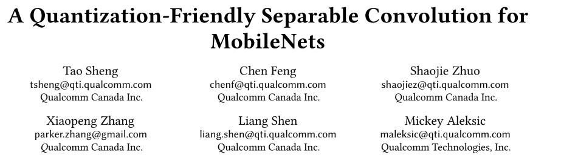

# A Quantization-Friendly Separable Convolution for MobileNets

论文：《A Quantization-Friendly Separable Convolution for MobileNets》

论文地址：https://arxiv.org/pdf/1803.08607.pdf

这篇是高通在 2018 年发表的一篇论文，主要是针对在量化方面效果很差的 MobileNetV1 网络进行研究，探索其量化掉点很严重的原因（从浮点模型的 70.5%到量化模型的 1.8%），发现根因主要是来自可分离卷积，尽管它使得 MobileNetV1 大大减少了参数量和存储量，但副作用就是导致量化效果很差，因此作者提出了3 种改进来解决这个问题，提升了 MobileNetV1 的量化效果：

1. 去掉可分离卷积中的 BN 和 ReLU6 ；
2. 在其它网络层中使用 ReLU 替代 ReLU6；
3. 可分离卷积层中使用 L2 正则化

上述的操作最终是提升了量化效果，从只有 1.8% 提升到 68.03%，大大减少了量化掉点的问题。

------

## 1. 简介

量化对于在手机、IoT 平台上运行深度学习的推理操作是非常关键的，主要是这些平台在功耗和存储使用方面有比较大的限制，而这些平台其实非常依赖如同数字信号处理器 （DSP）这样的定点计算硬件模块来实现比 GPU 更高效的表现。而在这样的平台上，常用的深度网络结构，比如 VGG，GoogleNet，ResNet 等都因为其参数量、计算量过大，很难部署在手机平台上，而一些轻量网络，则可以通过将标准卷积替换为深度可分离卷积的方法来取得准确率和效率之间的平衡，如下图 a 和 b 所示，比如谷歌提出的 MobileNetV1，大大降低了参数量和存储量，因此是常用的部署到手机上的网络结构。不过副作用就是使用的分离卷积层造成了巨大的量化损失，从而使得其量化效果非常差。

为了上述说的量化问题，作者使用 TensorFlow 框架来实现了 MobileNetV1 和 InceptionV3，并对比浮点模型和量化后顶点模型的准确率，如下图所示，可以看到 InceptionV3 的准确率在量化后并没有下降太多，反倒是 MobileNetV1 量化后的准确率大幅度下降，作者也给出对两个网络的评价，前者是只有标准卷积，而后者主要用了可分离卷积。

有几种方法是有可能解决这个量化掉点严重的问题：

1. 最直接的方法就是使用更多bits 的量化，比如从 8bit 提升到 16bit 是可以提升准确率的，但是也会提升模型的参数量和计算量，这个受到目标平台的容量限制；
2. 第二种方法就是可以重新训练一个专门用于定点推理的量化模型；

对于第二个方法，谷歌在论文《Quantization and Training of Neural Net works for Efficient Integer-Arithmetic-Only Inference》中提出了一个量化训练的框架，它可以在前向训练中模拟量化效果，而在反向传播中保持原来的浮点训练的操作。这个框架是通过了额外的训练能减少量化损失，不过对于多个不同的平台需要维护多个模型。

而在本文中，作者是对可分离卷积层使用了新的结构设计从而构建了一个轻量级的量化友好的网络。新的结构只需要单次浮点训练，训练得到的模型可以部署到不同的平台，无论是浮点还是定点推理，都是最小的精度损失。为了实现这个目的，作者是通过查找 MobileNetV1 在量化上精度损失的根因，并基于发现的原因设计了一个新的量化友好的 MobileNetV1，在浮点模型方面可以保持准确率，并且在量化后的定点模型的精度大大提升。

本文的贡献在于：

1. 作者认为 bn 和 ReLU6 是造成 MobileNetV1 量化损失较大的主要原因；
2. 提出了一个量化友好的可分离卷积，并且在浮点训练和量化定点中证明了其在 MobileNetV1 上的效率；

------

## 2. 量化方案和损失分析

本节将研究基于 TensorFlow（TF） 实现的 8bit 量化的 MobileNetV1 模型在定点 pipeline 中精度损失的根因，下图展示了一个经典的 8bit 量化流程。一个 TF 的 8bit 量化模型首先是直接从预训练的浮点模型中生成，其权重首先是离线量化的，然后在推理阶段，所有的浮点输入都先量化为一个 8bit 的无符号数值，然后再传到一个顶点的运行时操作，比如 `QuantizedConv2d, QuantizedAdd, QuantizedMul` 等，它们会生成 32 位的累计结果，然后通过激活反量化（activation re-quantization）步骤转成一个 8bit 的输出，然后这个输出再传给下一个操作。

### 2.1 TensorFlow 的 8bit 量化方案

TensorFlow 的 8bit 量化使用一个均匀量化器，也就是说所有的量化步长都是等长的。

让 $x_{float}$ 表示浮点输入 x，而 TensorFlow 量化后的 8bit 数值表示为 $x_{quant8}$，则其计算公式如下：

其中 $\triangle_x$ 表示的就是量化步长，b 表示位宽，比如本文提到的 8bit，就是 b=8，而 $\delta_x$ 表示偏置值，而 $x_{min},x_{max}$ 分布表示浮点数值范围的最小值和最大值，另外 $[\cdot]$ 表示最近的凑整操作，在 TensorFlow 中的实现是如下所示：

基于上述的定义，对于一个卷积操作的累计结果的计算如下所示：

最后，给定输出的已知的最大值和最小值，将上述 (1)-(4) 公式结合起来，反量化得到的输出可以通过下述公式计算得到：

### 2.2 量化损失的度量

正如上述图 2 中所示，在这个量化的流程中有 5 种类型的损失，包括了输入的量化损失、权重量化损失、运行时饱和损失、激活值反量化损失和可能的对确定的非线性操作的修建损失，如 ReLU6。为了更好的了解不同类型的损失提供的贡献，本文采用了信号到量化的信噪比（Signal-to-Quantization-Noise Ratio ，SQNR）作为评估每个网络层输出的量化精度，SQNR 的计算如下所示，其定义为非量化的信号 x 的能量除以量化误差 n 的能量：

由于输入信号 x 的平均量级是远大于量化步长 $\triangle_x$ ，所以一个合理的假设是量化误差是一个服从 0 均值的均匀分布，并且其概率密度函数（PDF) 是结合为 1，因此，对于一个 8bit 的线性量化器，其噪音能量可以如下计算得到：

结合(2)，(7)和(6)，可以得到如下公式：

SQNR 和信号的分布关系很大，根据（8）式，SQNR 很明显是由x 的能量以及量化范围决定的，因此增加输入信号的能力或者减少量化的范围都可以提升输出的 SQNR。

### 2.3 对 MobileNetV1 的量化损失分析

#### 2.3.1 深度卷积层中的 BN

如下图(b) 所示，MobileNetV1 的核心层包含了一个深度卷积（depthwise convolution）和逐点卷积(pointwise convolution)，并且它们后面都跟着一个 BN 和 非线性激活函数，比如 ReLU 或者 ReLU6。而在 TensorFlow 的实现中这里是使用 ReLU6 作为非线性激活函数的。

假设 x 是每层的输入，它包括 d 个通道，每个 batch 的大小是 m，则在深度卷积中 BN 是独立的在每个通道中进行转换，其计算公式如下：

其中 $\hat{x}_i^{k}$ 表示经过归一化的在通道 k 的第 i 个输入值 $x_i^{k}$，而 $\mu^k, \sigma^k$ 表示整个 batch 的均值和方差，$\gamma^k, \beta^k$ 表示大小和转移值。而$\epsilon$ 是一个设定好的非常小的常数，在 TensorFlow 的实现中，其数值是 0.0010000000475。

在定点流程中，BN 的转换可以被折叠起来，首先令：

则（9）式可以重写为：

在 TensorFlow 的实现中，每个通道 k 中，$\alpha$ 可以结合权重并折叠到卷积操作中从而减小计算消耗。

虽然深度卷积是单独应用到每个通道中，但是权重量化的最小值和最大值的选择范围是所有的通道，这会导致一个问题就是某个通道的一个离群点很可能导致整个模型的巨大的量化损失，因为离群点会加大了数据的数值范围。

此外，没有跨通道的修正操作，深度卷积很可能在一个通道里产生全 0 的数值，这导致该通道的方差是 0，并且这种情况在 MobileNetV1 种是很常见的。而根据公式（10），方差是 0 的时候由于设置的非常小的常数$\epsilon$ ，$\alpha$ 会非常大，如下图所示，测量了32 个通道中的 $\alpha$  数值，由于零方差导致的 6 个离群点$\alpha$ 是增大了量化范围，这导致的结果就是量化位数会由于要保持这些来自全 0 通道的巨大的数值而浪费了，相反那些带有信息的通道的较小的$\alpha$ 反而没有被保留下来，使得整个模型的表征能力变差很多。

从实验中可以知道，在没有重新训练的情况下，通过将这些全 0 通道的方差改为其余通道的方差的均值，可以很好的解决这个问题，这可以让量化后的 MobileNetV1 模型在 ImageNet2012 验证集上的精度从之前的 1.8%提升到 45.73%。

标准的卷积层是在一个步骤中完成了对输入的滤波和合并得到新的输出数值，而在 MobileNetV1 中深度可分离卷积将这个操作分成两层，深度卷积实现滤波的操作，而逐点卷积实现合并的操作，从而大大减小了计算代价和模型大小，并且可以保持模型精度。

基于上述的原则，本文是考虑移除了深度卷积后的 BN 和 ReLU6，让深度卷积来学习合适的权重从而替代了 BN 的作用，这样的操作即可以保持特征的表征能力，又使得模型能很好实现量化操作。

如下图所示，这里使用 SQNR 来观察每层的量化损失，其中黑线表示原始版本的将 $\alpha$ 折叠到卷积权重里的 MobileNetV1，蓝线则表示在所有深度卷积层中移除了 BN 和 ReLU6 ，红线表示的是在移除深度卷积层的 BN 和 ReLU6 后，还在逐点卷积层中使用 ReLU 而不是 ReLU6，另外保留逐点卷积层中的 BN 和 ReLU6，然后使用的图片是从 ImageNet2012的验证集中每个类别随机选择 1 张图片，总共 1000 张图片，从实验结果可以知道保留深度卷积层里的 BN 和 ReLU6 会大大降低每层输出的 SQNR。

#### 2.3.2 ReLU6 还是 ReLU

本节还是用 SQNR 作为评价标准，依然是上图所示，这里主要是探讨在逐点卷积层中使用的非线性激活函数，ReLU6 还是 ReLU。需要注意的是对于一个线性量化器，当输入信号分布越均匀，SQNR 就越高，否则就越低；

从上图中首先可以观察到，使用 ReLU6 的时候在第一个煮点卷积层的时候SQNR 都是有明显的降低，根据公式(8)，尽管 ReLU6 是可以降低量化范围，但是输入信号的能量也因为 clip 操作被降低了。理想的情况是其 SQNR 应该和 ReLU 相似，但实际上 clip 操作的副作用是在前面几个网络层的时候会扭曲了输入信号的分布，使其对量化不够友好，从实验结果来看就是导致第一层到其它层的时候SQNR 的降幅很大；

#### 2.3.3 对权重的 L2 正则化

正如前文说的 SQNR 跟信号的分布关系很大，作者进一步在训练中对所有的深度卷积层的权重使用了 L2 正则化，L2 正则化可以惩罚大量级的权重，而较大的权重是可能导致增大量化范围，使得权重分布变得不够均匀，从而导致量化损失较大，而一个更好的权重分布是能得到一个精度更好的量化模型。

------

## 3. MobileNets 的量化友好的卷积

基于第二节对量化损失的分析，作者提出了一个用于 MobileNet 的量化友好的分离卷积框架，其目标是解决巨大的量化损失从而在不用重新训练的情况下，量化模型可以得到和浮点模型相似的准确率。

如下图 c 所示即为作者提出的新的分离卷积层，这包含了 3 个主要的改变来使得可分离卷积变得量化友好：

1. **从所有的深度卷积层中移除了 BN 和 ReLU6**。
2. **在其余层中用 ReLU 代替 ReLU6**。作者认为 6 是非常随意的一个数值，ReLU6 尽管可以让模型在较早的学习到稀疏的特征，但是它的 clip 操作也在较早的层里扭曲了输入的分布，导致得到对量化并不好的分布，从而会降低每层的 SQNR。
3. **训练的时候，在所有深度卷积层中对权重使用 L2 正则化**。

最终本文提出的量化友好的 MobileNetV1 的网络结构如下表所示，在移除了深度卷积的 BN 和 ReLU6 后，该网络结构还保留原有的降低计算损失和模型大小的优点，并且能让量化模型的精度和浮点模型接近。

------

## 4. 实验

本文的实验使用了 TensorFlow 来实现的修改后的 MobileNetV1，训练参数和原始版本一样，修改的地方是 batch 大小是 128，显卡使用的是 Nvidia 的 GeForce GTX TITAN X，使用 ImageNet2012 数据集作为训练集和验证集，并且训练只是用于浮点模型。

实验结果如下图所示，分别展示了不同版本下的浮点模型和量化模型的准确率，原版本的准确率分别是 70.5%和 1.8%，然后对于本文的提出三个改变，分别做了实验和测试：

1. 仅仅移除深度卷积层的 BN 和 ReLU6，浮点模型的准确率略微提升到 70.55%，而量化模型则是大大提升到 61.5%；
2. 在 1 的基础上将 ReLU6 都变为 ReLU，浮点模型提升到 70.8%，而量化模型则提升到了 67.8%；
3. 继续增加对权重的 L2 正则化，浮点模型略微降低到 70.77%，但量化模型继续提升到了 68.03%。

------

## 5. 结论

本文是分析了轻量级网络 MobileNetV1 难以量化（量化掉点严重）的根因，发现主要是由于深度卷积中的 BN 和 ReLU6 导致的，因为深度卷积的特性是对每个通道进行操作，它很容易导致整个通道都是 0 的数值，这会导致该通道的方差为 0，而根据 BN 的计算公式，就会导致产生的 $\alpha$ 非常大，即产生了较大的离群点，这会影响量化范围，使得信息量较大但数值较小的数值都量化到同个定点，而这些离群点并不包含或者包含较少信息，反而被保留下来，这会大大降低量化模型的特征表征能力，从而降低了量化模型的精度。

基于这个发现，作者是直接移除了深度卷积的 BN 和 ReLU6，并且实验结果也验证了这个操作的可行性，而之后做的两个改变，使用 ReLU 代替其它层的 ReLU6 的提升效果也很明显，而 L2 正则化提升则比较一般，当然这里作者似乎没有做个实验来比较 L2 正则化对量化模型提升更大，还是都使用 ReLU 提升更大；

此外，目前仅在 MobileNetV1 上做了实验，作者也提到需要在其他也使用了可分离卷积的网络中验证这个方法，比如 MobileNetV2，ShuffleNet，以及本文做的是分类，还需要验证在其他的任务，比如检测、分割上是否也有效果。

