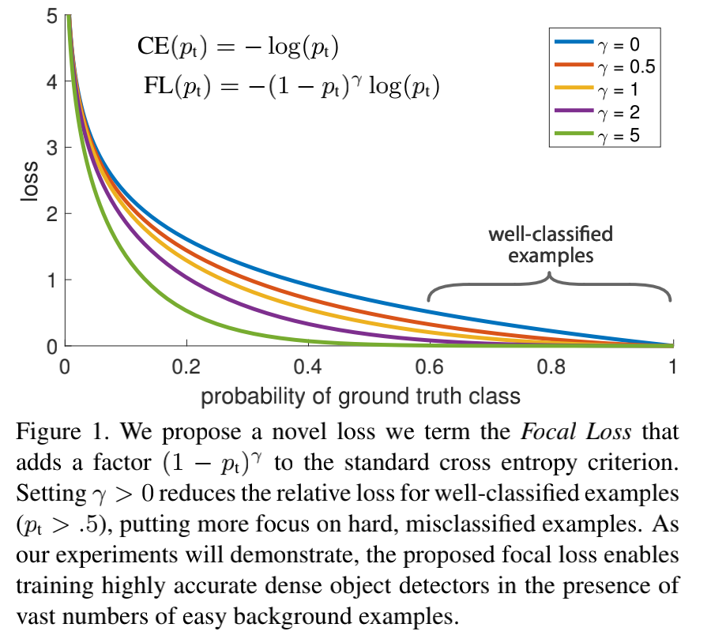

# Focal Loss for Dense Object Detection

论文：《Focal Loss for Dense Object Detection》

论文地址：https://arxiv.org/abs/1708.02002

代码地址：

- 官方 github：https://github.com/facebookresearch/detectron
- tensorflow：https://github.com/tensorflow/models
- https://github.com/fizyr/keras-retinanet
- https://github.com/yhenon/pytorch-retinanet

目前在目标检测领域里二阶段的方法精度是优于一阶段的，尽管一阶段的检测器处理的是更密集的样本，应该可以做到更快、更简单，作者认为没有实现这种期望的原因是在于正负样本的极度不平衡（前景和背景），所以作者提出了一个新的 loss，称为 Focal Loss，它通过修改标准的交叉熵函数，比如可以降低对识别很好的样本的权重，这样它会专注于训练少量困难样本，而不会被大量简单的样本所干扰。

另外，就是基于 FPN 提出了一个新的检测框架，称为 RetinaNet，实验表明它在精度上优于当前最好的二阶段检测算法，速度上好过一阶段的检测算法。

## 1. Introduction

当前主流的目标检测方法是分为两阶段 two-stage 和 一阶段 one-stage：

- 两阶段的做法是先在第一个阶段生成了稀疏的候选 bbox，然后第二阶段对这些 bbox 进行分类，判断是目标物体还是背景，两阶段检测算法也是当前精度最高的目标检测算法
- 一阶段的检测方法是直接处理大量的候选 bbox，检测和分类同时完成，尽管速度很快，但是其精度相比于两阶段最好的算法还是有 10%-40%的差距；

作者认为一阶段检测算法的主要问题在于没有很好处理类别不平衡的问题：

- 两阶段检测算法在第一个阶段同个如 RPN等方法生成候选 bbox 的时候，就会过滤掉大量的背景样本，在第二阶段进行分类的时候，采样策略使用了如固定的前后景比例（1：3），或者在线困难样本挖掘（ online hard example mining ，OHEM)都可以保持一个合理的类别比例；
- 一阶段检测算法虽然也采取了同样的采样策略，但是由于候选的 bbox 数量太多（超过 100k），这些策略会由于很多容易分类的背景样本导致非常低效，当然这个也是目标检测里的经典问题，也有一些解决办法，比如 boostrapping，或者困难样本挖掘；
- 类别不平衡问题在一阶段和两阶段检测算法中都存在，它会导致两个问题：
  - 由于大量易分类的负样本（背景）导致训练是低效的，因为这些样本不能提供有效的信息；
  - 易区分的负样本也会破坏模型的训练，导致模型的退化；

作者希望结合一阶段和二阶段的优点，即做到又快又精准，所以提出了一个新的 loss 函数，称为 Focal Loss，其作用是动态调整交叉熵函数的大小，设置的缩放因子会随着样本是否容易区分而变化，如下图所示：

直观上来说，这个缩放因子会自动降低易区分样本的权重，让模型在训练的时候专注于训练少量的困难样本。

为了验证这个方法的有效性，作者使用 RPN 作为骨干网络，提出了一个一阶段检测框架，并成为 RetinaNet，其实验结果如下图所示，结果表明 RetinaNet 可以做到速度和精度之间的平衡，速度比二阶段检测算法更快，精度比一阶段检测算法更好。

另外，作者强调了 RetinaNet 取得这样的成果主要是依赖于 loss 的改进，在网络结构方面并没有创新。

## 2. Focal Loss

Focal Loss 是为了解决一阶段检测算法中极度类别不平衡的情况(比如正负样本比 1:1000)所设计的 loss 函数，它是对标准的交叉熵函数的修改。

首先，标准的交叉熵函数公式如下：
$$
CE(p,y)=CE(p_t)=-log(p_t)
$$
其中 y 表示样本的真实标签，这里用二分类举例，所以 y 的取值就是 1 或者 -1，而 p 是模型预测的概率，取值范围是 [0,1]，然后 $p_t$ 是：

在第一节Introduction的 Figure1 里，最上边的蓝色曲线就是表示交叉熵损失函数面对不同样本的 loss，可以看到即便是非常容易区分的样本，即 $p_t$ 远大于 0.5 的样本，交叉熵计算得到的 loss 依然是非常的大，如果把大量的这种样本的 loss 进行求和，会破坏少量的困难样本提供的信息。

### 2.1 Balanced Cross Entropy

之前也有人提出了一个平衡的交叉熵函数，如下所示：

这里引入了一个权重因子 $\alpha$ ，它和类别数量成反比，也就是类别数量越少的类别，其 loss 权重会越大。这也是本文方法的 baseline。

不过这个 loss 函数的问题在于增加的权重因子只是区分了正负样本，但是并不能区分容易分类和很难分类的样本，因此本文是针对这点进行了改进，提出了 Focal Loss。

### 2.2 Focal Loss

Focal Loss 的计算公式如下：

这里增加了一个超参数 $\gamma$ ，作者称为聚焦参数(focusing parameter)，在本文实验中 $\gamma=2$ 的效果最好，而它为 0 的时候就是标准的交叉熵函数。

对于 Focal loss，有两个特点：

1. 当有样本被误分类，并且 $p_t$ 很小的时候，调节因子 $(1-p_t)^\gamma$ 是接近于 1，对于 loss 来说是影响不大，但随着 $p_t$ 趋向于 1，这个因子会逐渐趋向于 0，则对于分类很好的样本的 loss 也会变小从而达到降低权重的效果；
2. 聚焦参数 $\gamma$ 会平滑的调节易分类样本调低权值的比例；$\gamma$ 增大能增强调节因子的影响，实验中表明了$\gamma =2$ 是效果最好，直观上来说，调节因子减少了易分类样本的损失贡献，拓宽了样本接收到低损失的范围。 

在实际应用中，会结合平衡交叉熵，得到的 focal loss 如下所示，这样既可以调整正负样本的权重，又可以控制难易分类样本的权重：

实验中表明这个 loss 可以比不加入 $\alpha$ 的 loss 提升一点精度。

### 2.3 Class Imbalance and Model Initialization

在二分类中，默认二分类的输出概率都是相等的，但这种初始化会导致数量很多的类别的 loss 在整体 loss 中占据较大的比例，这会影响训练初期的稳定性。

对于这个问题，作者在初期训练中为少数类（即前景）的模型评估 $p$ 引入了一个 `prior` 的概念，并用 $\pi$ 表示它，然后将其设置为比较小的数值，实验表明无论是使用交叉熵还是 focal loss，在面对严重的类别不平衡的问题时，这个做法都能提高训练的稳定性。

### 2.4 Class Imbalance and Two-stage Detectors

两阶段的检测算法一般都是使用标准的交叉熵函数，很少使用平衡的交叉熵或者 focal loss，它们处理类别不平衡问题主要是依靠两个机制：

1. 两阶段的串联方式；
2. 有选择的 mini-batch 的采样方式

在第一阶段就会减少大量的候选 bbox，将数量降低到 1-2k，并且并非随机删除，而是可以删除了大量的负样本；在第二阶段会采用有选择的采样方法来构建 mini-batch，比如采用正负样本比是 1:3 的比例，这个比例的作用等同于平衡的交叉熵中加入的 $\alpha$ 参数。

------

## 3. RetinaNet Detector

RetinaNet 的整体结构如下图所示：

RetinaNet 是一个一阶段检测框架，它包含了一个骨干网络以及两个特定任务的子网络，骨干网络是对输入图片计算其特征图，然后两个子网络分别骨干网络的输出做分类和候选框回归的工作。

### Feature Pyramid Network 骨干网络

RetinaNet 采用 FPN 作为骨干网络，FPN 的结构如上图的 a-b，这里是基于 ResNet 构建的 FPN，它是一个自顶向下，带有侧面连接的卷积神经网络，在输入是单种分辨率的情况下，它可以得到多种尺度的特征。

本文是构建了一个 P3 到 P7的金字塔，其中 l 表示金字塔的级别，$P_l$ 的分辨率是输入的分辨率的 $1/2^l$ ，每个级别的金字塔的通道数量都是 C = 256.

### Anchors

本文采用了 translation-invariant anchor boxes，每个 anchor 在金字塔的 P3 到 P7分别拥有 $32^2$ 到 $512^2$ 的区域，并且在每个金字塔级别设置的高宽比是 {1:2, 1:1, 2:1} ，对应的设置缩放比例是 {$2^0, 2^{1/3}, 2^{2/3}$} ，最终在每个金字塔层上是产生了 A=9 个 anchors，并且能覆盖对应网络输入图片上 32~813 像素的区域。

每个 anchor 都是 K 个分类目标的 one-hot 向量（K 表示类别数量）和 4 个 box regression 的目标。作者设定 anchor 的方式是和真实标签物体检测框的 IoU（intersection-over-union）的阈值为 0.5，和背景的 IoU 是 [0, 0.4)，而如果是在 [0.4，0.5)，训练的时候将被忽略；

回归检测框（Box regression）目标是计算每个 anchor 和其分配的物体框的偏移量，如果没有设定则是忽略。

### 分类子网络（Classification Subnet）

分类子网络的作用是预测在每个空间位置上，A 个 anchor 和 K 个类别物体出现的概率。这个子网络是一个小型的 FCN，并且和 FPN 每层都连接，然后子网络的参数是在所有金字塔层中都共享的。

这个子网络的设计比较简单，给定某个金字塔层的通道数量是 C的输入特征图，然后会先通过 4 个卷积核为 $3\times 3$ ，数量是 C 的卷积层，并采用 ReLU 激活函数，接着是一个卷积核同样是 $3\times3$ ，但是数量是 $K\times A$ 的卷积层，然后用 sigmoid 激活函数并对每个空间位置输出 KA 个二值预测，在本文实验中，C=256，A=9.

这里对比 RPN 网络，本文采用的分类子网络是层数更多，并且仅采用 $3\times 3$ 的卷积核，同时并没有和下面介绍的 box regression 子网络共享参数，**这是因为作者发现更高层的设计决定会比特定值的超参数更加重要**。

### 回归检测框子网络（Box Regression Subnet）

跟分类子网络是并行的关系，作者同样采用一个小型的 FCN 网络，并且也是和FPN 每层相连接，目的是回归每个 anchor box 对相邻真实标签物体的偏移量。

在网络设计方面和分类子网络是类似的，不相同的是输出的是4A 个线性输出。对于每个空间位置上的 A 个 anchor，这 4 个输出预测的是 anchor 和真实标签检测框的偏移量，另外和现在大部分工作不同的是，作者采用了一个 class-agnostic bounding box regressor，即可以用更少的参数但更加高效。

分类子网络和回归检测框子网络是共享相同的网络结构，但是分别采用不同的参数。

## 4. 实验

实验结果如下：

a）在标准交叉熵 loss 基础上增加了参数 $\alpha$ 的结果，其中 $\alpha=0.5$ 就是传统的交叉熵，表格中可以看出在 0.75 的时候效果最好，AP 提升了 0.9；

b）对比了不同 $\gamma$ 和 $\alpha$ 的实验结果，随着 $\gamma$ 的增加，AP提升比较明显，另外当 $\gamma =2$ 的时候是效果最好的时候；

c）对比了 anchor 的大小 scale 和长宽比 aspect ratio 对于效果的影响，最好的结果是分别选择 2 和 3 的时候；

d）和采用 OHEM 方法的对比，这里看到最好的 OHEM 效果是 AP=32.8，而 Focal Loss 是 AP=36，提升了 3.2，另外这里 OHEM1:3 表示通过 OHEM 得到的 minibatch 中正负样本比是 1：3，但是这个做法并没有提升 AP；

e）对比了在不同网络模型深度和输入图像大小下的AP 和速度。

## 5. 结论

本文作者认为一阶段检测算法不能在性能上超过二阶段检测算法的根本原因是类别的极度不平衡问题，为了解决这个问题，提出了一个 focal loss，它对标准的交叉熵 loss 进行修改从而可以实现让网络模型更专注学习困难的负样本。本文的方法是简单但高效的，并且设计了一个全卷积的一阶段检测框架来验证其高效性，实验结果也表明了其可以达到 state-of-art 的精度和速度。

